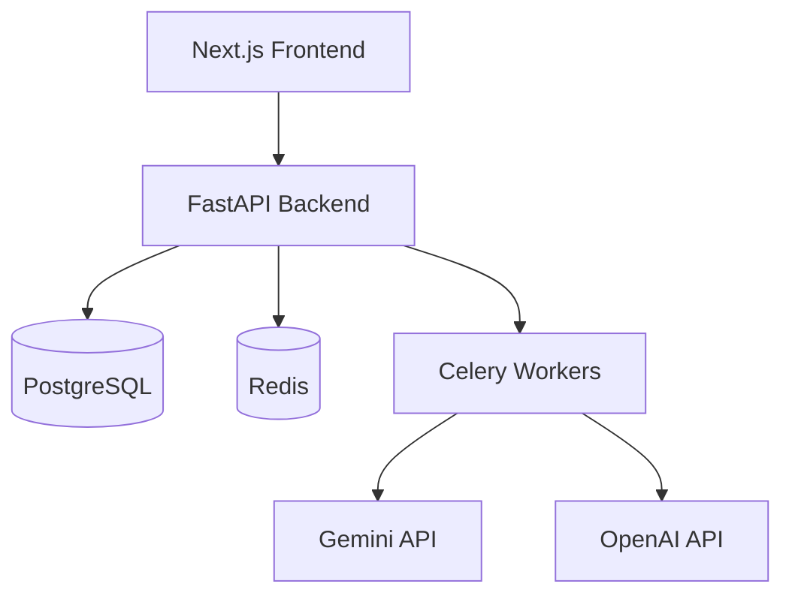

# IntelliView Orchestrator Architecture

## Overview

IntelliView Orchestrator is an AI-powered interview management platform that automates interview scheduling, candidate evaluation, real-time monitoring, and reporting.

The platform follows a distributed architecture where the frontend communicates with a FastAPI backend, which manages interview sessions, databases, AI services, and background workers.

---

## High-Level Architecture

## Main Components

### Frontend

- Built using Next.js

- Provides dashboard interface

- Displays candidate information

- Shows interview progress

- Connects to backend APIs

---

### Backend

The backend is built using FastAPI.

Responsibilities include:

- User authentication

- Session management

- Candidate management

- AI orchestration

- Request validation

- Logging

- Monitoring

- API routing

---

### Database

PostgreSQL stores:

- Candidates

- Interview Sessions

- Question Bank

- Interview Templates

- Evaluation Results

SQLAlchemy ORM is used for database operations.

---

### Redis

Redis is used for:

- Caching

- Session storage

- Celery message broker

- Fast data access

---

### Worker Services

Background workers perform:

- Audio analysis

- Video analysis

- AI evaluation

- Risk scoring

- Report generation

---

### AI Providers

The project supports multiple AI providers.

- Google Gemini

- OpenAI

- Grok

Fallback logic allows another provider to be used if one becomes unavailable.

---

### Monitoring

The project includes:

- Prometheus metrics

- Grafana dashboards

- Health monitoring

- Structured logging

---

## Workflow

1. Candidate starts interview.

2. Frontend sends request to FastAPI.

3. Backend creates interview session.

4. Session is stored in PostgreSQL.

5. Workers process audio/video.

6. AI evaluates responses.

7. Results are saved.

8. Dashboard displays live updates.

---

## Technologies Used

- Python

- FastAPI

- Next.js

- PostgreSQL

- SQLAlchemy

- Redis

- Celery

- Docker

- Prometheus

- Grafana
