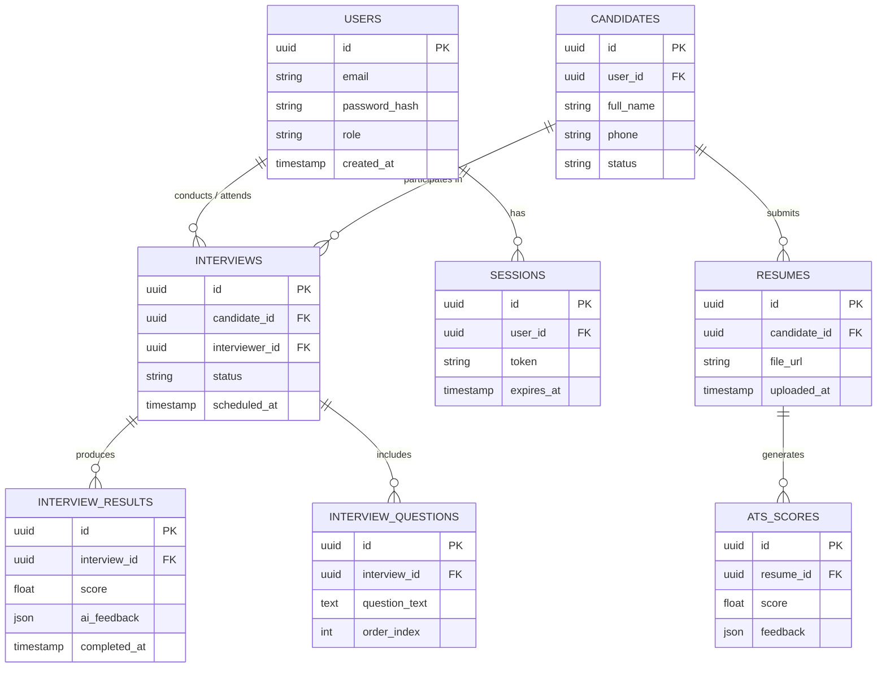

# Database — IntelliView Orchestrator

> ⚠️ **Fill-in note:** I don't have access to your actual schema (private repo, no DB tool connected on my end). Below is a realistic starting schema based on the platform's known features (auth, candidate management, interview engine, AI scoring). **Replace table/column names with your real schema** — the fastest way is to run the export command in section 4 and paste the result in place of the draft below.

## 1. Overview

The database is the system of record for users, candidates, interviews, and AI-generated results. It is used by the Auth, Candidate Management, Interview Engine, and AI & Analytics modules.

## 2. Entity-Relationship Diagram



## 3. Table Reference

### `users`
| Column | Type | Notes |
|---|---|---|
| id | UUID (PK) | |
| email | string, unique | |
| password_hash | string | never store plaintext |
| role | enum (`admin`, `hr`, `candidate`, `interviewer`) | |
| created_at | timestamp | |

**Indexes:** unique index on `email`; index on `role` for permission filtering.

### `candidates`
| Column | Type | Notes |
|---|---|---|
| id | UUID (PK) | |
| user_id | UUID (FK → users.id) | |
| full_name | string | |
| phone | string | |
| status | enum (`applied`, `interviewing`, `hired`, `rejected`) | |

**Indexes:** index on `user_id`; index on `status` for pipeline/dashboard queries.

### `resumes`
| Column | Type | Notes |
|---|---|---|
| id | UUID (PK) | |
| candidate_id | UUID (FK → candidates.id) | |
| file_url | string | points to object storage |
| uploaded_at | timestamp | |

### `ats_scores`
| Column | Type | Notes |
|---|---|---|
| id | UUID (PK) | |
| resume_id | UUID (FK → resumes.id) | |
| score | float | 0–100 |
| feedback | JSON | structured ATS feedback |

### `interviews`
| Column | Type | Notes |
|---|---|---|
| id | UUID (PK) | |
| candidate_id | UUID (FK → candidates.id) | |
| interviewer_id | UUID (FK → users.id), nullable | null if AI-only interview |
| status | enum (`scheduled`, `in_progress`, `completed`, `cancelled`) | |
| scheduled_at | timestamp | |

**Indexes:** composite index on `(candidate_id, status)` for dashboard filtering; index on `scheduled_at` for calendar queries.

### `interview_questions`
| Column | Type | Notes |
|---|---|---|
| id | UUID (PK) | |
| interview_id | UUID (FK → interviews.id) | |
| question_text | text | |
| order_index | int | display order |

### `interview_results`
| Column | Type | Notes |
|---|---|---|
| id | UUID (PK) | |
| interview_id | UUID (FK → interviews.id) | |
| score | float | |
| ai_feedback | JSON | model output / rationale |
| completed_at | timestamp | |

### `sessions`
| Column | Type | Notes |
|---|---|---|
| id | UUID (PK) | |
| user_id | UUID (FK → users.id) | |
| token | string, unique | JWT or opaque session token |
| expires_at | timestamp | |

**Indexes:** unique index on `token`; TTL/cleanup job for expired sessions.

## 4. How to generate the real schema doc

Once you have DB access, replace the draft above with the actual schema:

```bash
# Postgres example — dump schema only, no data
pg_dump --schema-only your_database_name > schema.sql
```

Or, if using an ORM (e.g. SQLAlchemy/Prisma), generate the diagram directly from your models rather than hand-maintaining this file, and link that generator here.

## 5. Relationships Summary

- A **user** can be a candidate, interviewer, or HR/admin (`role` field).
- A **candidate** has many **resumes** and many **interviews**.
- Each **resume** produces one or more **ATS score** records over time.
- Each **interview** has many **questions** and produces one **result** record.
- **Sessions** track active logins per user for auth.

---

*Definition of Done: schema diagram, relationships, and indexes are documented well enough that a new developer can write a correct query against this database without reading the ORM models first.*
